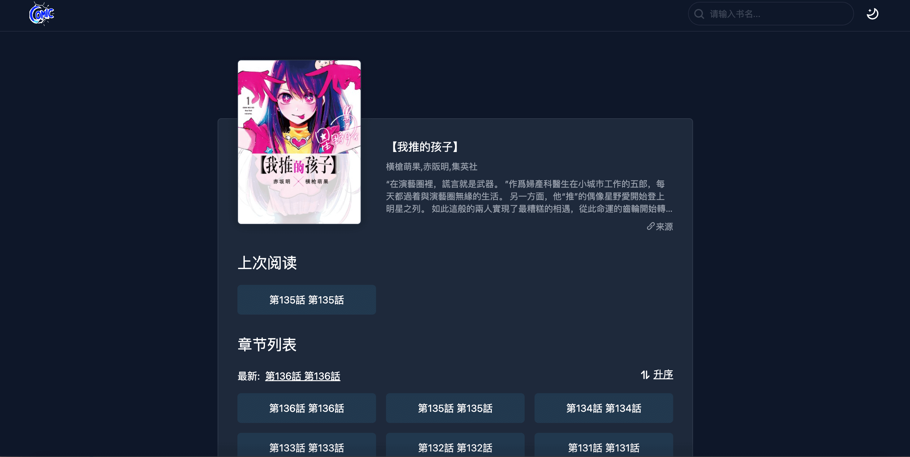

# Comic Book Browser


<!-- markdownlint-disable MD033 -->

<p align="center">
  <b>一款漫画浏览器(搭配<a href="https://github.com/gxr404/comic-book-dl">comic-book-dl</a>使用)</b><br/>
  <b>开源 | 高效 | 易用</b><br/><br/>
  
  
  
  <br>
</p>

## 安装

```bash
npm i -g comic-book-browser
```

## 用法

```bash
$ comic-book-browser --help

  Usage:
    $ comic-book-browser <command> [options]

  Options:
    -d, --bookPath <dir>  漫画目录(comic-book所在的目录) eg: -d . (default: .)
    -p, --port <port>     服务启动的端口号 eg: -p 3000 (default: 3000)
    -h, --help            Display this message
    -v, --version         Display version number
```

### Start

使用 [comic-book-dl](https://github.com/gxr404/comic-book-dl) 下载完漫画后在当前含有`comic-book`目录
执行:

```bash
# 当前目录需含有 comic-book文件夹
$ comic-book-browser

> comic-book-browser [INFO]:  \(^o^)/ 服务已启动 请用浏览器打开 http://127.0.0.1:3000
```

### 界面

`comic-book-browser`提供了两套主题、适配移动端、界面简洁





## 功能与建议

目前项目处于开发初期, 如果你对该项目有任何功能与建议，欢迎在 Issues 中提出
